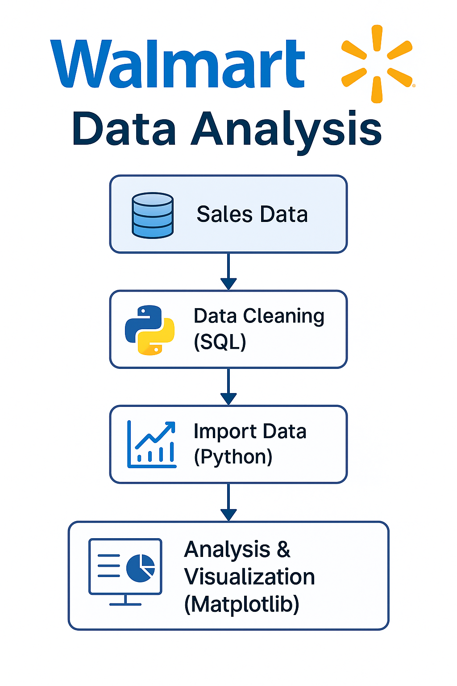

# 🛍️ Walmart Sales Analysis Project (SQL + Python)



This project is a practical exploration of retail analytics using SQL and Python. I took a dataset of 10,000 Walmart sales transactions and turned it into a full data pipeline: from raw CSV to insights and visualizations. The goal was to replicate how a data analyst or business intelligence professional would work in a real-world environment.

---

## 🧠 Project Objective

The primary goal was to analyze sales performance across multiple branches, cities, and product lines at Walmart. The project answers specific business questions such as:

- Which branch and city generated the highest revenue?
- What times of the day see the most customer traffic?
- Which product lines are performing the best?
- How do payment methods vary across branches?
- Are there differences in customer ratings by city or payment method?

---

## 🔄 Workflow Overview

This project follows a clean and repeatable data analysis pipeline:

1. **Data Collection**: The dataset (`Walmart.csv`) contains 10,000+ records of real sales data.
2. **Data Cleaning**: Cleaned missing values, standardized column names, and formatted data types.
3. **Database Creation**: Loaded the cleaned data into PostgreSQL using a custom schema.
4. **SQL Analysis**: Wrote and ran queries to extract meaningful metrics.
5. **Python Integration**: Used SQLAlchemy to connect PostgreSQL with Pandas.
6. **Visualization**: Built charts and tables in Jupyter Notebook using Matplotlib.

---

## 📊 Key Findings

- 🏪 **Branch C** had the highest total revenue and customer satisfaction scores.
- ⏰ Sales peaked during **evening hours (6 PM – 9 PM)**.
- 🛍️ **Electronic Accessories** and **Food & Beverages** were the top-selling product lines.
- 💳 **Ewallet** usage was the highest in urban areas like Yangon.
- 🌆 Customers in **Yangon** gave the highest average ratings.

---

## 📂 Project Files

| File | Description |
|------|-------------|
| `Walmart.csv` | Raw dataset with 10,000+ sales records |
| `walmart-sales-datasets-cleaned.csv` | Cleaned and preprocessed dataset |
| `Walmart Postgresql.sql` | SQL script for table creation and data insert |
| `walmartData.ipynb` | Python notebook for EDA, SQL integration, and charts |
| `requirements.txt` | Required Python libraries |
| `walmart-10k-sales-datasets.zip` | Compressed archive of the full dataset |

---

## ⚙️ Tools Used

- **SQL Engine**: PostgreSQL
- **Language**: Python 3.x
- **Libraries**: pandas, sqlalchemy, pymysql, psycopg2, matplotlib
- **IDE**: Jupyter Notebook

---

## 🚀 How to Run the Project

1. Clone the repository:
    ```bash
    git clone https://github.com/your-username/walmart-sales-analysis.git
    cd walmart-sales-analysis
    ```

2. Create and activate a virtual environment (optional but recommended).

3. Install the dependencies:
    ```bash
    pip install -r requirements.txt
    ```

4. Set up PostgreSQL and run the SQL script:
    ```sql
    -- Inside your SQL editor
    \i Walmart Postgresql.sql
    ```

5. Open the Jupyter notebook:
    ```bash
    jupyter notebook walmartData.ipynb
    ```

---

## 🙋‍♂️ About Me

This project was independently built and customized from scratch. It's more than a tutorial follow-along — I structured the schema, cleaned the data, created the visual story, and documented every step.

If you're into data or want to collaborate on a future project, feel free to connect.

- GitHub: [Sainath-cloud](https://github.com/Sainath-cloud)
- LinkedIn: [Sainath Emmadi](https://www.linkedin.com/in/sai-n-emmadi)

---

## 📄 License

This project is open-source under the MIT License.
